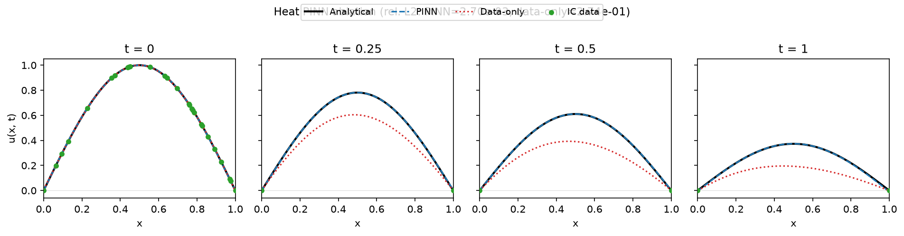
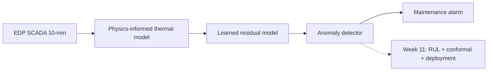

# wind-digital-twin

Hybrid **digital twin** capstone for a wind-turbine **gearbox/drivetrain thermal** path: EDP SCADA → physics-informed expected temperature → learned residual correction (Week 10+) → anomaly detector → maintenance alarms. Week 11 adds **RUL**, **conformal uncertainty**, and deployment.

Full taxonomy, fidelity levels, and pipeline diagram: **[docs/ARCHITECTURE.md](docs/ARCHITECTURE.md)**.

## Quickstart

```powershell
python -m venv .venv
.\.venv\Scripts\Activate.ps1
pip install -e ".[dev]"
pre-commit install

# Optional: PINN heat toy (PyTorch; CI stays torch-free by default)
pip install -e ".[pinn]"
python scripts/run_pinn_heat.py

python scripts/generate_synthetic_edp.py --force
python scripts/download_edp.py --check
python scripts/run_gearbox_thermal.py
pytest tests/ -q
```

Real EDP data: see [data/README.md](data/README.md) and `python scripts/download_edp.py --instructions`.

## Why physics-informed? (PINN ablation)

Week 10 guardrail: a 1-D heat equation \(u_t = \alpha u_{xx}\) on \([0,1]^2\) with sparse **initial and boundary** labels only (no interior sensors). A plain MLP fits those points; with **physics loss off** (`w_f=0`) it does not recover the true decay in the interior (relative L2 **~2.7×10⁻¹** vs analytical). The same architecture with a **PDE residual** at collocation points (`w_f=1`) matches the analytical solution (**~2.7×10⁻³** relative L2).



That pattern is what we want on SCADA: sparse temperature observations plus a **thermal ODE/physics consistency** term, not interpolation between sensors. Code: [`src/wind_digital_twin/pinn/`](src/wind_digital_twin/pinn/), [`scripts/run_pinn_heat.py`](scripts/run_pinn_heat.py), notebook [`notebooks/pinn_heat_toy.ipynb`](notebooks/pinn_heat_toy.ipynb). Paper notes: [docs/reading_notes.md](docs/reading_notes.md).

## Architecture (summary)



## What this means in maintenance terms

- **Physics layer:** A **lumped thermal ODE** predicts expected oil/bearing temperature from power, RPM, and nacelle proxy (with time constant τ on healthy data). “At this load and cooling context, the gearbox *should* be this hot.” When actual temperature runs **hotter than expected** (negative residual), that is extra heat the operating point does not explain — a common precursor to lubrication or bearing problems.
- **Residual / detector:** Sustained “hotter than expected” patterns trigger an **inspection window** measured in **days before logged failure**, not a single spike from a production ramp.
- **Uncertainty (Week 10 baseline):** Healthy validation RMSE and score thresholds from **healthy training only**; Week 11 adds **conformal intervals** so alarms carry an explicit false-alarm / coverage story.
- **Evaluation:** Training excludes the **90 days before failure**; metrics are **time-ordered** so you do not accidentally train on pre-failure drift.

Agent and contribution rules: [AGENT.md](AGENT.md). Current status: [handover.md](handover.md).

## License

Apache-2.0 — see [LICENSE](LICENSE).
