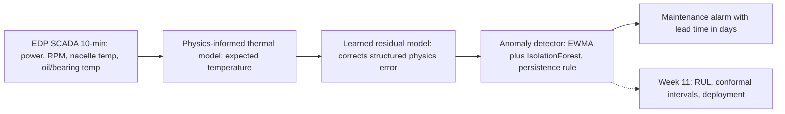

# Capstone architecture — hybrid drivetrain digital twin

Track B capstone: a **hybrid digital twin** for wind-turbine **gearbox/drivetrain thermal** behavior. SCADA from the EDP open dataset (same backbone as [wind-turbine-anomaly](https://github.com/mehmetertac/wind-turbine-anomaly)) feeds a physics-informed expected-temperature model, a learned residual correction (Week 10+), and an anomaly detector. Week 11 adds RUL, conformal uncertainty intervals, and a deployment sketch.

---

## Digital twin taxonomy

| Class | Idea | Strengths | Failure modes |
|-------|------|-----------|---------------|
| **Data-driven** | Pure ML on SCADA (autoencoders, IF, LSTM-AE on raw features) | Fast to train; captures complex patterns | Confuses operating-point changes with faults; weak extrapolation |
| **Physics-based** | Simulation or analytical thermal/network models | Interpretable; respects conservation and load physics | Wrong physics or missing sensors → systematic bias; slow to calibrate |
| **Hybrid** | Physics backbone for **expected behavior** + ML on **residuals** or learned corrections | Strips load/ambient variance; degradation shows in what physics cannot explain | Still needs honest evaluation and uncertainty; two models to maintain |

This capstone is **hybrid**: a steady-state thermal normal-behavior model (power, RPM, nacelle proxy) defines expected oil/bearing temperature; anomalies live in the **residual stream**, not raw temperature alone.

---

## Fidelity levels (where OEM twins sit)

| Level | What it does | Typical OEM practice |
|-------|----------------|----------------------|
| **Shadow** | Mirror SCADA on a dashboard; no model | Common for fleet visibility |
| **Descriptive** | “What happened” analytics | Fleet KPIs, curtailment |
| **Diagnostic** | Root-cause hints on components | Partial — often vendor-specific |
| **Predictive** | Failure warning, RUL, health index | **Most common “digital twin” claim** for drivetrain/gearbox — usually **component-level**, not full aero-elastic closed loop |
| **Prescriptive** | Recommended actions (curtail, inspect) | Emerging; rarely fully automated onshore |
| **Closed-loop** | Twin drives control setpoints | Rare on commercial WT; research / specific subsystems |

**This repo (Week 10 scaffold):** hybrid, **component-level** (gearbox thermal path), **predictive** advisory (lead time in days), **open-loop** — alarms for maintenance planning, not turbine control.

---

## Pipeline (README diagram)

### Layer contracts

| Layer | Output | Uncertainty (Week 10 → 11) | Leakage-free evaluation | Maintenance meaning |
|-------|--------|----------------------------|---------------------------|---------------------|
| **SCADA ingest** | Clean 10-min panel per turbine | Data QC flags (future) | Time-ordered splits only | “What the machine actually did” |
| **Physics thermal** | Predicted oil/bear °C, residual = pred − actual | Healthy validation RMSE / residual spread | Train on healthy rows only; 90-day buffer before failure | “Expected heat for this load — extra heat is suspicious” |
| **Learned residual** | Corrected expectation (port: Ridge/GBM baseline from anomaly repo) | Model disagreement vs physics (future) | Same healthy mask; no future failure labels in train | “Physics is close but systematically wrong here” |
| **Anomaly detector** | Score + sustained alarm | Threshold from healthy score distribution; **Week 11: conformal** | 99th-percentile threshold, persistence, cooldown on train scores | “Schedule inspection — failure likely within horizon” |
| **Week 11** | RUL distribution + intervals | Conformal / calibrated prediction sets | Rolling-origin backtest | “How many days until intervention — with stated confidence” |

---

## Scope (fixed for capstone)

**In scope**

- Gearbox **oil** and **bearing** temperature thermal path
- EDP Wind Farm 1 SCADA + failure log (or synthetic generator for CI/local)
- Per-turbine physics model + residual features + Isolation Forest hybrid (ported baseline)

**Out of scope (later threads)**

- Vibration / CWRU fusion (sensor-fusion week material)
- Electrical subsystem, pitch/yaw twins
- Closed-loop control or OEM proprietary simulators
- Full-farm aero-elastic digital twin

---

## Upgrades vs [wind-turbine-anomaly](https://github.com/mehmetertac/wind-turbine-anomaly)

| Piece | Anomaly repo (Week 6) | This capstone |
|-------|----------------------|---------------|
| Physics | Ridge/GBM steady-state thermal | PINN-informed or constrained thermal (Week 10 toy + optional upgrade) |
| Residual | Implicit in IF features | Explicit **learned residual model** |
| Detector | IF on residual windows | Same baseline → calibrated thresholds + richer scoring |
| Uncertainty | Threshold percentile only | **Conformal intervals** on scores/RUL (Week 11) |
| Product | Benchmark blog artifact | **Digital twin narrative** + deployment sketch |

Ported code lives under `src/wind_digital_twin/{physics,residual,anomaly}` — upgrade in place, do not rewrite from scratch.

---

## Module map

| Path | Role |
|------|------|
| [`src/wind_digital_twin/data/`](../src/wind_digital_twin/data/) | EDP load, clean, synthetic fallback |
| [`src/wind_digital_twin/physics/`](../src/wind_digital_twin/physics/) | Gearbox thermal normal-behavior model |
| [`src/wind_digital_twin/residual/`](../src/wind_digital_twin/residual/) | Residual feature engineering |
| [`src/wind_digital_twin/anomaly/`](../src/wind_digital_twin/anomaly/) | Physics-hybrid detector (IF) |
| [`src/wind_digital_twin/eval/`](../src/wind_digital_twin/eval/) | Lead time, false alarms, plots |
| [`scripts/run_gearbox_thermal.py`](../scripts/run_gearbox_thermal.py) | Fit physics layer + write residuals |

---

## Roadmap

| Week | Deliverable |
|------|-------------|
| **10 (this scaffold)** | Architecture doc, repo layout, ported physics + hybrid baseline, tests + hooks |
| **10 (PINN guardrail)** | Read ≤2 papers; heat-equation PINN **toy** in `notebooks/`; do not block capstone on theory |
| **10 (residual)** | Learned residual model replacing/adjacent to linear physics error |
| **11** | RUL head, conformal prediction intervals, deployment README + minimal serve path |
| **Friday** | [`WEEK_10_REFLECTION.md`](../WEEK_10_REFLECTION.md) — honest uncertainty + leakage checklist + maintenance reading |

---

## References (light touch)

- Karniadakis et al. — Physics-informed neural networks (theory; capstone stays applied)
- OEM / industry: component-level hybrid twins for drivetrain monitoring (predictive maintenance narratives)
- Dataset: EDP Open Data / Hack the Wind SCADA (see [`data/README.md`](../data/README.md))
