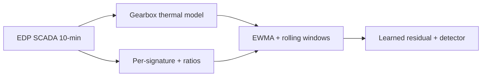

# Sensor fusion design — EDP SCADA → residual model features

Capstone scope: **gearbox oil and bearing temperature** path on EDP Wind Farm 1 (10-minute SCADA). This document inventories channels by **signature type**, states what EDP **does not** provide, and specifies the **fused feature set** for the upcoming learned residual model (spec only—[`residual_features.py`](../src/wind_digital_twin/residual/residual_features.py) still implements physics-residual EWMA/rolling only).

Related: [ARCHITECTURE.md](ARCHITECTURE.md), [reading_notes.md](reading_notes.md) (Pujana hybrid twin), ported thermal rationale in [wind-turbine-anomaly PHYSICS_THERMAL](https://github.com/mehmetertac/wind-turbine-anomaly/blob/main/docs/PHYSICS_THERMAL.md).

---

## Data sources for this inventory

| Source | What it gives |
|--------|----------------|
| IEA Task 43 [EDP Open Data details](https://iea-wind.org/wp-content/uploads/2024/07/EDP-OpenData-Details.pdf) | ~**83** SCADA columns per row; categories: generator/rotor RPM, drivetrain/nacelle temperatures, wind, ambient, active/reactive power, pitch, grid V/I/frequency/phase, nacelle direction. **No vibration category.** |
| Mendeley / EDP dataset description | Same 83-column operational telemetry; separate met-mast, event log, failure log. |
| This repo [`config.py`](../src/wind_digital_twin/config.py) | Seven columns loaded today for the thermal baseline. |
| Published EDP studies (e.g. gearbox CUSUM reproducibility report) | Confirms `Gear_Bear_Temp_Avg` as **high-speed shaft bearing** temperature. |

**Honesty:** Full raw CSVs are not committed here (fixtures are 7-column subsets). Column names below marked **confirm on ingest** should be verified against a local `wind-farm-1-signals-*.csv` header after download ([`data/README.md`](../data/README.md)).

---

## Channels in use today (repo)

| Column | Signature | Role in capstone |
|--------|-----------|------------------|
| `Gear_Oil_Temp_Avg` | Thermal | Physics **target** (oil sump) |
| `Gear_Bear_Temp_Avg` | Thermal | Physics **target** (HSS bearing) |
| `Grd_Prod_Pwr_Avg` | Electrical / mechanical load | Physics **driver** |
| `Rtr_RPM_Avg` | Mechanical (slow) | Physics **driver** |
| `Nac_Temp_Avg` | Thermal (ambient proxy) | Physics **driver** |
| `Amb_WindSpeed_Avg` | Environmental | Panel / regime (not thermal driver yet) |
| `Amb_WindDir_Relative_Avg` | Environmental | Panel / regime |

Operating filter for thermal path: **power > 50 kW** ([`THERMAL_MIN_POWER_KW`](../src/wind_digital_twin/config.py)).

---

## EDP signature inventory (full file, not all wired)

### Thermal

| Representative columns | Notes |
|------------------------|--------|
| `Gear_Oil_Temp_Avg`, `Gear_Bear_Temp_Avg` | Gearbox path **targets** |
| `Nac_Temp_Avg` | Nacelle interior; ambient proxy for steady-state model |
| `Amb_Temp_Avg` | **confirm on ingest** — onsite ambient; preferred for \(\theta\) ratios once met-mast is joined |
| `Gen_Bear_Temp_Avg`, `Gen_Bear2_Temp_Avg` | **confirm on ingest** — generator bearings; **context** (misaligned gen fault vs gearbox) |
| `Hyd_Oil_Temp_Avg` | **confirm on ingest** — hydraulic group; context for nacelle heat balance |
| `HVTrafo_Phase*_Temp_Avg`, converter/busbar temps (naming varies) | **confirm on ingest** — electrical heat sources in nacelle; not gearbox targets |

**Not in EDP:** oil **flow rate**, oil **pressure**, particle counts, IR borescope—documented limitation in PHYSICS_THERMAL (oil *temperature* only).

### Electrical

| Representative columns | Notes |
|------------------------|--------|
| `Grd_Prod_Pwr_Avg` | Active power (kW); already thermal driver |
| `Grd_Prod_PsblePwr_Avg`, reactive power, `Grd_Prod_CosPhi_Avg` | **confirm on ingest** — curtailment / power-factor regime |
| `Grd_Prod_VoltPhse1_Avg` … `Phse3` | **confirm on ingest** — phase voltage imbalance |
| `Grd_Prod_CurPhse1_Avg` … `Phse3` | **confirm on ingest** — phase current imbalance |
| Grid frequency columns | **confirm on ingest** — weak gearbox link; grid event flag only |

Electrical subsystem twin is **out of scope** ([ARCHITECTURE.md](ARCHITECTURE.md)); these channels **condition** thermal interpretation (imbalance, derate), not a second failure head.

### Mechanical (slow SCADA)

| Representative columns | Notes |
|------------------------|--------|
| `Rtr_RPM_Avg` | Rotor speed; thermal driver |
| `Gen_RPM_Avg`, `Gen_RPM_Std` | **confirm on ingest** — generator speed; gear-ratio check |
| `Blds_PitchAngle_Avg`, `_Min`, `_Max`, `_Std` | **confirm on ingest** — collective pitch; **curtailment** vs fault |

### Environmental (turbine-mounted vs met-mast)

| Source | Notes |
|--------|--------|
| `Amb_WindSpeed_*`, `Amb_WindDir_*` on turbine SCADA | Already in repo panel |
| Met-mast file (41 columns) | Independent anemometers, ambient T/P/RH—optional upgrade for ambient in \(\theta\) and physics drivers |

### Vibration — not in EDP

EDP Wind Farm 1 SCADA is **10-minute averaged operational telemetry**. There are **no** CMS channels such as:

- Nacelle / gearbox **accelerometers** (HSS, IMS, LSS, main bearing)
- Envelope spectra, band energy, or order tracking
- High-rate shaft speed for tooth-mesh diagnostics

Ten-minute means **cannot** resolve gear-mesh or bearing-defect frequencies. That is a **sensor-class gap**, not a modeling failure.

**Production twin would add:**

| Modality | Typical use |
|----------|-------------|
| CMS accelerometers (HSS/IMS/LSS, main bearing) | Early bearing/gear tooth faults (**T06**, **T09 noise**) |
| Oil debris / particle counter | Wear progression |
| Oil **pressure** and **flow** | Pump/circuit faults (**T01 pump damaged**) before sump temperature drifts |

---

## Physics layer (unchanged contract)

Per [`physics/gearbox_thermal.py`](../src/wind_digital_twin/physics/gearbox_thermal.py) and [`physics/lumped_ode.py`](../src/wind_digital_twin/physics/lumped_ode.py):

\[
\tau \frac{dT}{dt} = T_{\mathrm{eq}} - T, \qquad
T_{\mathrm{eq}} = T_{\mathrm{nac}} + \beta_0 + \beta_P P + \beta_\omega\,\mathrm{RPM}
\]

(Steady-state Ridge with \(P^2\) remains a **validation baseline**, not the shipped backbone.)

\[
\text{residual} = T_{\mathrm{predicted}} - T_{\mathrm{actual}}
\]

**Degradation signal:** \(-\text{residual}\) (actual hotter than expected → positive degradation).

Fusion features sit **alongside** existing EWMA and rolling stats on oil/bear degradation ([`build_residual_feature_frame`](../src/wind_digital_twin/residual/residual_features.py)); they do **not** replace the physics layer.

---

## Fused feature set (learned residual model — spec)

All point features computed on **operating rows** unless noted. Apply the same **healthy-only train mask** and **90-day pre-failure buffer** as the physics hybrid ([ARCHITECTURE.md](ARCHITECTURE.md)).

### A. Per-signature features

| Group | Features | Intent |
|-------|----------|--------|
| **Thermal (physics)** | `oil_deg`, `bear_deg` (= \(-\) oil/bear residual) | Primary degradation; already in IF pipeline |
| **Thermal (raw delta)** | `delta_bear_oil` = `Gear_Bear_Temp_Avg` − `Gear_Oil_Temp_Avg` | Bearing heats before sump on bearing fault; pump/flow fault often lifts oil with weaker split |
| **Electrical context** | `Grd_Prod_Pwr_Avg` (optional duplicate if model needs load without physics pred) | Regime |
| **Electrical imbalance** | `I_imbalance` = std(\(I_1,I_2,I_3\)) / mean(\(\|I_i\|\)) when `Grd_Prod_CurPhse*_Avg` present | Bad power normalizer flag—not a gearbox score alone |
| **Electrical imbalance** | `V_imbalance` — same for phase voltages | Grid/converter asymmetry |
| **Mechanical** | `Rtr_RPM_Avg`, `Blds_PitchAngle_Avg` (**confirm on ingest**) | Load speed vs curtailment |
| **Mechanical flag** | `curtailment_hint`: pitch above fleet/learned threshold while \(50 < P < P_{\mathrm{rated}}\) | Hot gearbox during derate ≠ damage |

**Do not** feed raw `Gear_*_Temp_Avg` into the detector **together with** physics residuals and \(\theta\) ratios—operating-point level returns to the score and revives false alarms in high-load regimes.

### B. Cross-signature ratios (EE-style thermal resistance)

Steady-state intuition: for fixed cooling, temperature rise above ambient proxy should scale with **dissipated power**. Formalize as **effective thermal resistance** (°C/kW):

\[
\theta_{\mathrm{oil}} = \frac{T_{\mathrm{oil}} - T_{\mathrm{nac}}}{P}, \qquad
\theta_{\mathrm{bear}} = \frac{T_{\mathrm{bear}} - T_{\mathrm{nac}}}{P}
\]

where \(P =\) `Grd_Prod_Pwr_Avg` (kW), \(T_{\mathrm{nac}} =\) `Nac_Temp_Avg` (°C). Later: replace \(T_{\mathrm{nac}}\) with met-mast `Amb_Temp_Avg` in \(\theta_*\) only, keeping physics drivers unchanged until recalibrated.

| Feature | Formula | Units | Maintenance read |
|---------|---------|-------|------------------|
| `theta_oil` | \((\mathrm{Gear\_Oil} - \mathrm{Nac}) / P\) | °C/kW | Rising \(\theta_{\mathrm{oil}}\) at similar load → worse oil cooling (**T01 pump**) |
| `theta_bear` | \((\mathrm{Gear\_Bear} - \mathrm{Nac}) / P\) | °C/kW | Bearing-specific overheating (**T06**) |
| `delta_bear_oil` | \(\mathrm{Gear\_Bear} - \mathrm{Gear\_Oil}\) | °C | Localized bearing heat |
| `torque_proxy` | \(P / \mathrm{Rtr\_RPM\_Avg}\) | kW/RPM | Combined load proxy physics splits into \(P\) and RPM |
| `gear_ratio` | \(\mathrm{Gen\_RPM\_Avg} / \mathrm{Rtr\_RPM\_Avg}\) | — | Stuck ratio vs nominal; **not** a tooth-fault detector at 10 min |

### C. Guard rails

| Rule | Value / action |
|------|----------------|
| Minimum power for \(\theta_*\), `torque_proxy` | \(P > 50\) kW (match thermal filter) |
| Minimum RPM for `torque_proxy`, `gear_ratio` | e.g. `Rtr_RPM_Avg` > 1 RPM ( tune on data ) |
| Missing optional columns | Skip imbalance / pitch / gen RPM features; do not impute from other turbines |
| Temporal smoothing | Same EWMA / rolling windows as residuals (6 / 36 / 144 samples = 1 h / 6 h / 24 h) applied to **fusion** features when fed to ML |

### D. Feature flow (target implementation)

---

## Maintenance reading vs logged failures

Ground truth: [`GEARBOX_FAILURES`](../src/wind_digital_twin/config.py). Evaluation turbines: **T01**, **T06**.

| Turbine | Logged event | Expected SCADA-fusion signature | CMS / production gap |
|---------|--------------|--------------------------------|----------------------|
| **T01** | Gearbox pump damaged | Sustained **`theta_oil`**, oil **`oil_deg`** / EWMA; **`delta_bear_oil`** may lag | **Flow/pressure** would alarm earlier; EDP has oil **temp** only |
| **T06** | Gearbox bearings damaged | **`bear_deg`**, **`theta_bear`**, rising **`delta_bear_oil`** | Accelerometer **envelope** would lead 10-min temperature |
| **T09** | Gearbox repaired / noise | Weak or absent on 10-min thermal alone | **Noise** is CMS-first; do not treat null thermal lead as model failure |
| **T07**, **T11** | Non-gearbox failures in synthetic log | Use as negative controls for gearbox features | — |

---

## Out of scope (unchanged)

- Full **electrical** twin (DFIG/converter like Pujana et al.)
- **Vibration / CWRU** fusion in this repo thread
- **Closed-loop** control or OEM proprietary simulators

---

## Next implementation step

1. Extend [`load_edp.py`](../src/wind_digital_twin/data/load_edp.py) / [`config.py`](../src/wind_digital_twin/config.py) with optional **fusion column groups** (confirm names on first real CSV load).
2. Add `build_fusion_feature_frame()` next to [`build_residual_feature_frame`](../src/wind_digital_twin/residual/residual_features.py).
3. Wire fused columns into the **learned residual model** when that module lands (handover: not started).
